# 易标投标工具箱 · 生产版功能说明

> **文档信息**
>
> | 项目 | 内容 |
> | --- | --- |
> | 适用版本 | client 0.1.0（生产模式） |
> | 代码基线 | `main` @ `fbdbd0b` |
> | 编写日期 | 2026-09-22 |
> | 覆盖范围 | **仅生产模式下对外开放的功能** |
> | 技术栈 | Electron 41 + React 19 + TypeScript 5.9 + Vite 7 + SQLite + .NET 10 |
> | 授权协议 | AGPL-3.0 |

---

## 一、宏观：这个工具在做什么

### 1.1 一句话

易标把**标书写作中最耗人力的两件事**交给 AI，并且全程在本机完成：

1. **写得太薄** → 把已有方案扩写成符合篇幅要求的厚标书
2. **写完怕出错** → 自动查重、逐条核对废标风险

### 1.2 用户旅程

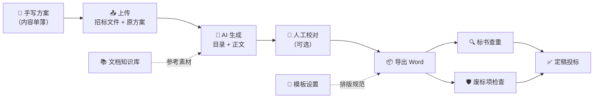

### 1.3 为什么生产版只放这四个模块

| 模块 | 定位 | 成熟度 |
| --- | --- | --- |
| **方案扩写** | 主生产线，直接产出交付物 | 稳定，主力功能 |
| **标书查重** | 成稿后的质量闸门 | 稳定，纯本地算法为主 |
| **废标项检查** | 成稿后的风险闸门 | 稳定，多轮 AI + 证据校验 |
| **文档知识库 / 模板设置** | 支撑能力，服务于上面三个 | 稳定 |

其余模块（从零生成技术方案、可研报告、AI 评标、投标机会、图片知识库）**代码仍在仓库中**，仅通过配置开关对生产用户隐藏，不影响后续开发。

---

## 二、功能地图

### 2.1 生产版菜单

```
📁 方案扩写            ← 一级入口，直接进入工作流
📁 标书检查
   ├─ 标书查重
   └─ 废标项检查
📁 知识库
   └─ 文档知识库
📁 模版设置
   ├─ 我的模板
   └─ 新建模板
⚙️ 设置
```

### 2.2 功能之间的协作关系

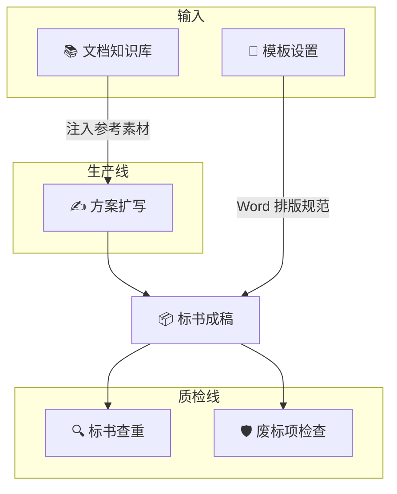

---

## 三、方案扩写（主力功能）

### 3.1 它解决什么问题

人写的技术方案通常**事实准确但篇幅不足**，评审时因为"内容不够详实"丢分。直接让 AI 重写又会**丢失原方案的真实内容**（把真实业绩、真实参数写没了）。

方案扩写的核心命题是：**在扩写的同时，保证原文一字不丢。**

### 3.2 用户操作流程

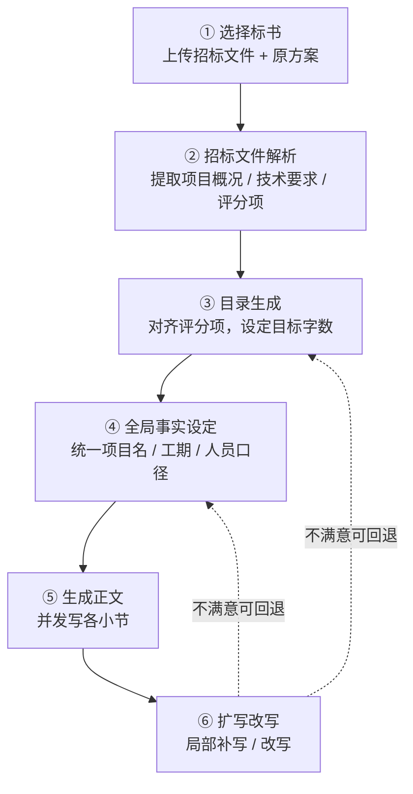

**六个步骤永远在同一个页面里流转**，进度实时可见，切走再切回来不丢。

### 3.3 后台流水线（核心）

点下「生成正文」后，Main 进程会跑一条 12 阶段的流水线。这是整个工具最复杂的一块：

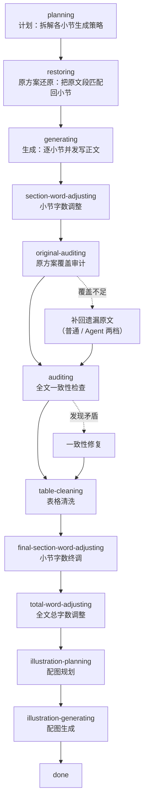

> 💡 **阶段是可配置的**：字数控制、一致性检查、覆盖审计、配图都可以在生成前关掉，流水线会自动跳过对应阶段。

### 3.4 四个关键机制

#### 机制一：原方案覆盖审计（扩写专有）

这是"扩写不丢原文"的技术保障。

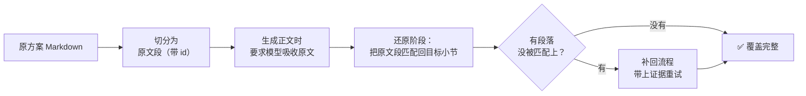

补回有两种档位：

| 档位 | 做法 |
| --- | --- |
| `normal` | 用固定 Prompt 重试，带上未覆盖段落作为证据 |
| `agent` | 交给 Pi Agent 自主判断该补到哪里、怎么补 |

#### 机制二：字数控制

目录阶段就能设定篇幅目标：

| 参数 | 作用 |
| --- | --- |
| `minimumWords` | 全文最少字数 |
| `maximumWords` | 全文最多字数 |
| `sectionWords` | 单节目标字数（默认 3000） |
| `strictSectionWords` | 是否严格执行单节字数 |

系统会自动校验：**叶子小节数量 × 单节字数** 是否落在全文目标区间内，不在区间就给出提示。

#### 机制三：全文一致性检查

各小节是并发生成的，模型很容易写出**互相矛盾的口径**（工期一处写 180 天、一处写 6 个月）。

一致性检查会在全文生成后通读一遍，找出冲突并修复。

#### 机制四：配图（可选）

三类图片任选，各有数量上限：

| 类型 | 生成方式 | 默认上限 |
| --- | --- | --- |
| **AI 生成图** | 调生图模型 | 6 张 |
| **Mermaid 图** | AI 写代码 → 本地渲染（失败会自动修复重试） | 5 张 |
| **HTML 图示** | AI 写 HTML → 本地渲染截图 | 10 张 |

**配图复用**是省钱的关键设计：生成新图前先检索文档知识库里的历史图片，命中就直接复用。

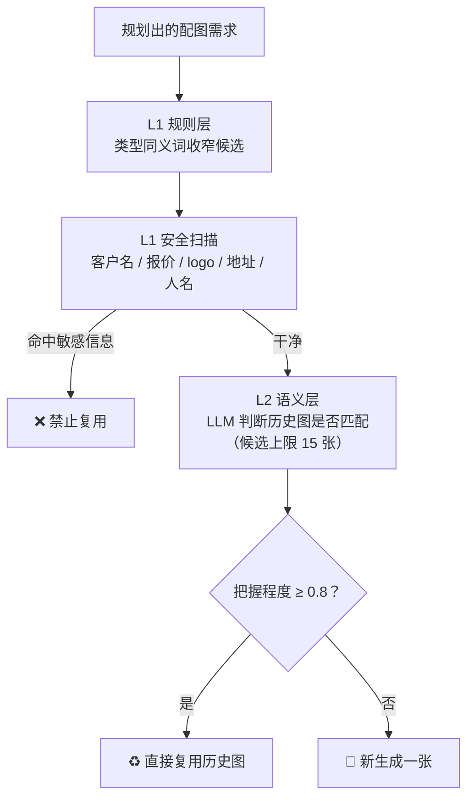

> ⚠️ 安全扫描在语义判断**之前**执行：只要图片疑似含旧项目名、报价数字、客户 logo，无论多匹配都禁止复用。

### 3.5 怎么实现的

#### 数据流

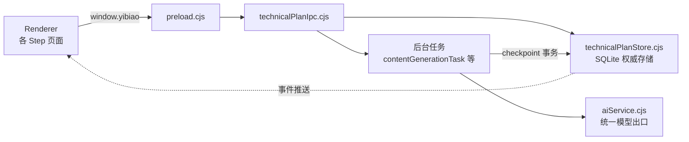

#### 目录与正文的权威来源

**`technical_plan_outline_nodes` 表是唯一权威**，Renderer 侧对应 `outlineData.outline[*].content`。

保存目录时传的 `reason` 字段是**持久化协议**，用错会出大事：

| reason | 行为 | 正文 |
| --- | --- | --- |
| `replace` | 重建全部 | ⚠️ **清空** |
| `edit` / `delete` / `add-*` | 只失效受影响节点 | 保留其余 |
| `sort` | 重映射 | ✅ 保留并重排 |

> ⚠️ **省略 `reason` 会被当成 `replace`**，直接清空全部已生成正文。
>
> 且所有非 `sort` 的目录变更都会让正文任务和配图计划失效——这套失效逻辑由 Main 的 Store 统一完成，前端不另写一套。

#### 任务与断点恢复

正文生成跑在 Main 后台，**页面卸载不取消任务**。任务写库用 `checkpointTask()`：在同一个事务里提交任务状态和业务数据，保证不会出现"进度说完成了但正文没落库"。

重新进入页面时，从 **Store 快照 + `tasks.getActiveTasks()`** 回放恢复。

#### 关键文件

| 文件 | 职责 |
| --- | --- |
| `electron/services/contentGenerationTask.cjs` | 正文生成引擎（6800+ 行） |
| `electron/services/outlineGenerationTaskV2.cjs` | 目录生成 |
| `electron/services/globalFactsTaskV2.cjs` | 全局事实 |
| `electron/services/contentIllustrationPlanning.cjs` | 配图规划 |
| `electron/services/contentIllustrationGeneration.cjs` | 配图生成 |
| `electron/services/illustrationReuseService.cjs` | 配图复用检索 |
| `electron/services/technicalPlanStore.cjs` | SQLite 存储 |
| `src/features/technical-plan/` | 前端全部页面 |

> 💡 `technical-plan`（从零生成）和 `existing-plan-expansion`（扩写）**共用同一套页面、Store 和任务**，只靠 `workflowKind` 变量区分行为。改共用代码时必须两个入口都测。

---

## 四、标书查重

### 4.1 它解决什么问题

多份标书（或多份历史标书）之间是否存在抄袭式重复。人工比对几十万字不现实，工具做**结构化比对**。

### 4.2 整体流程

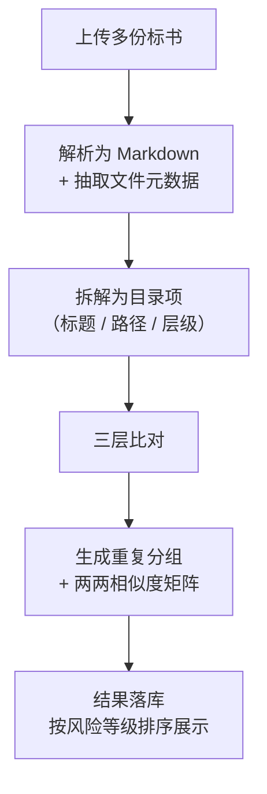

### 4.3 三层检测

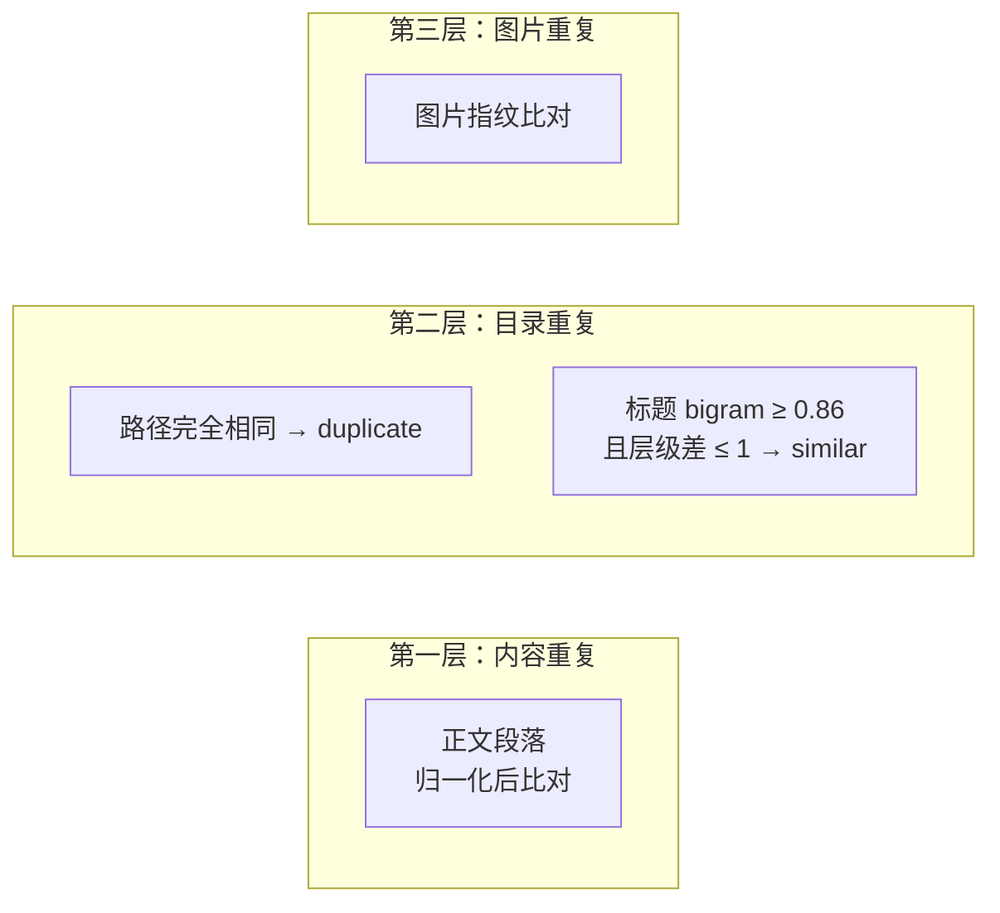

### 4.4 两两相似度怎么算

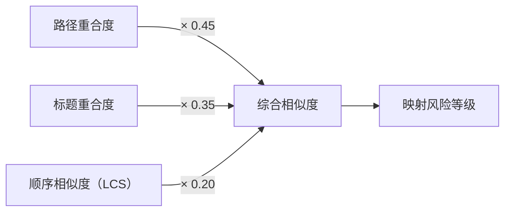

- **路径重合 / 标题重合**：交集大小 ÷ 较小集合大小
- **顺序相似度**：两个标书标题序列的**最长公共子序列**比例——抄目录的人往往连顺序一起抄

### 4.5 元数据取证（难点）

只看正文容易被"改词改写"绕过。所以还会抽取**文件底层痕迹**做同源判断：

| 来源 | 提取的证据 |
| --- | --- |
| 通用 | SHA256、创建/修改/访问时间 |
| Office 文档 | 作者、公司、模板名、修订号、**RSID 编辑会话指纹** |
| PDF | 版本、对象数、权限位、指纹 |
| OLE 复合文档 | Stream 路径与大小指纹、**宏存储检测** |

> 💡 **RSID 是 Word 的编辑会话 ID**。同一台机器、同一个文档反复另存，RSID 会呈现特征性重合——这比正文相似度更难伪造。

### 4.6 关键文件

| 文件 | 职责 |
| --- | --- |
| `electron/services/duplicateCheckService.cjs` | 解析、比对、取证全部逻辑 |
| `electron/services/duplicateCheckStore.cjs` | 结果落库（14 张表） |
| `src/features/duplicate-check/` | 前端页面 |

---

## 五、废标项检查

### 5.1 它解决什么问题

标书里**一处硬伤就能直接废标**——漏响应一条硬性条款、写错一个专业术语、前后数字矛盾。人工逐条核对成本极高且容易漏。

### 5.2 检查流程

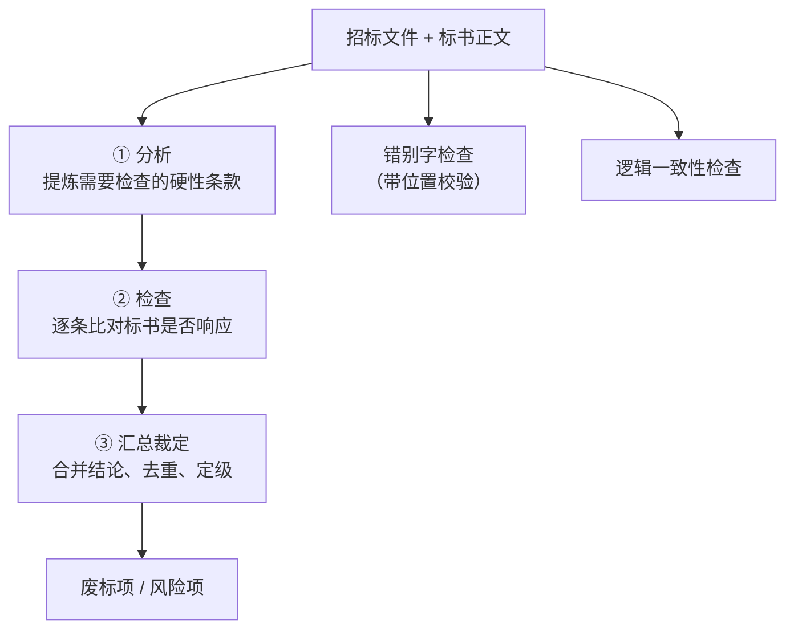

### 5.3 三类结果

| 标签页 | 检查内容 | 输出 |
| --- | --- | --- |
| **废标项** | 硬性条款是否响应、响应是否完整 | `invalidBid`（必然废标）/ `rejectionItem`（风险项），带严重程度 |
| **错别字** | 错字、用词错误 | 错处 + 位置 + 原文摘录 |
| **逻辑一致性** | 前后矛盾、口径打架 | 冲突点 + 涉及的两处原文 |

### 5.4 两个关键设计

#### 设计一：错别字必须"找得到位置"

模型报错别字很容易**幻觉**（挑一个原文里根本不存在的错）。所以每条错别字都会走**位置校验**：在原文里定位不到可信位置，这条结论就不采信。

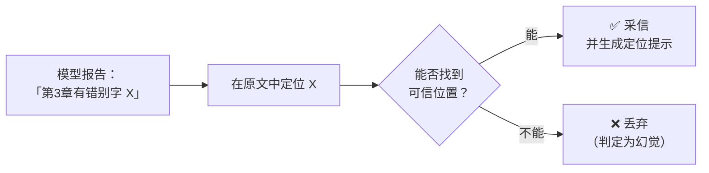

#### 设计二：长文档自动降级为分段

标书动辄几十万字，超出模型上下文窗口。系统会自动判断并切换策略：

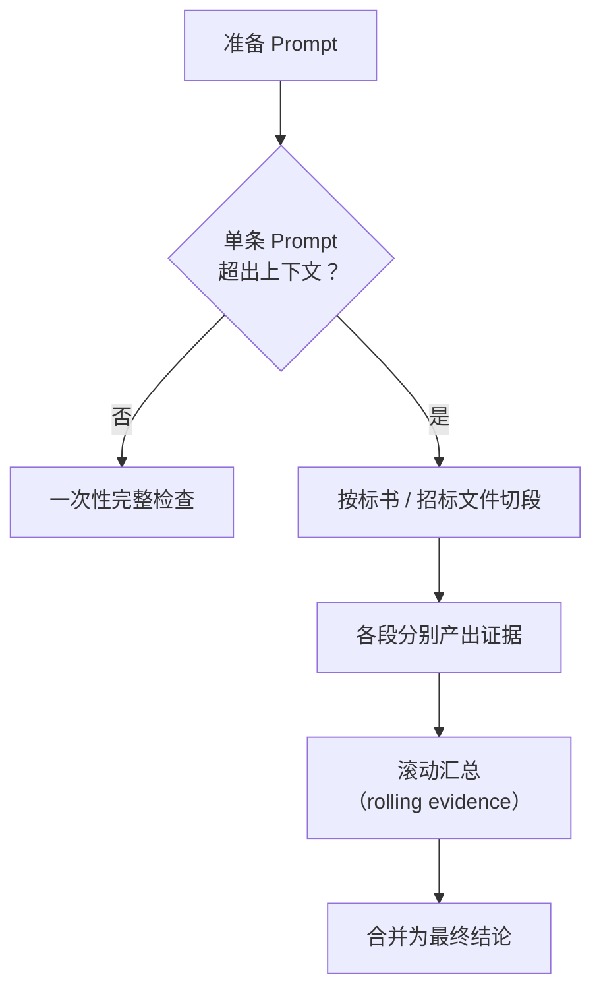

### 5.5 关键文件

| 文件 | 职责 |
| --- | --- |
| `electron/services/rejectionCheckTask.cjs` | 全部分析、检查、汇总逻辑（1700+ 行） |
| `electron/services/rejectionCheckStore.cjs` | 结果落库 |
| `src/features/rejection-check/` | 前端页面 |

---

## 六、文档知识库

### 6.1 它解决什么问题

把手头的**历史方案、成功案例、公司资料**变成可复用的知识条目，供方案扩写时注入参考，让 AI 写出来的内容更贴合本公司的真实情况。

### 6.2 加工流程

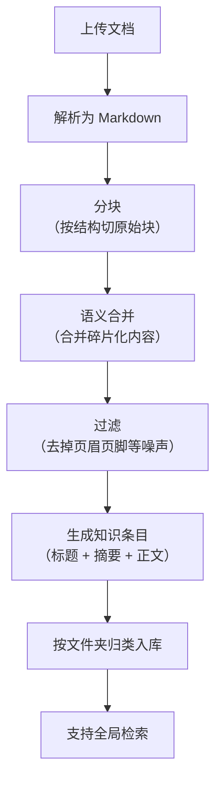

### 6.3 与方案扩写的协作


### 6.4 关键文件

| 文件 | 职责 |
| --- | --- |
| `electron/services/knowledgeBaseService.cjs` | 分块、合并、条目生成与匹配 |
| `electron/services/knowledgeBaseStore.cjs` | 落库 |
| `src/features/knowledge-base/` | 前端页面 |

---

## 七、模板设置与 Word 导出

### 7.1 它解决什么问题

投标文件对**排版格式有硬性要求**（字体、字号、标题编号、页边距）。模板设置把这些规则固化下来，导出的 Word 直接合规。

### 7.2 导出流水线

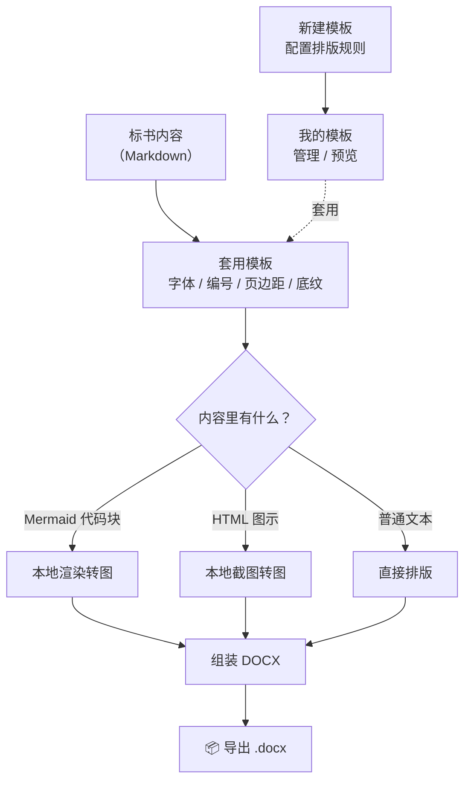

### 7.3 关键设计：全链路不联网

Mermaid 和 HTML 图示的转换**全部在本地完成**，不依赖任何外部渲染服务。

- Mermaid 以 Markdown ```mermaid 代码块持久化
- 前端用 `MarkdownRenderer` 本地预览
- 导出时由 Main 的 `localImageRenderService.cjs` 本地转图
- 高级排版交给 .NET 10 的 `openxmlhelper`（随客户端打包）

### 7.4 关键文件

| 文件 | 职责 |
| --- | --- |
| `electron/services/exportService.cjs` | DOCX 构建 |
| `electron/services/localImageRenderService.cjs` | Mermaid / HTML 本地转图 |
| `electron/services/templateWordAnalyzer.cjs` | Word 模板分析 |
| `openxmlhelper/` | .NET 10 排版助手 |
| `src/features/export-format/` | 模板配置页面 |

---

## 八、生产版是怎么打包出来的

### 8.1 生产模式开关

生产版与开发版**共用同一份代码**，靠一个配置开关切换可见范围。

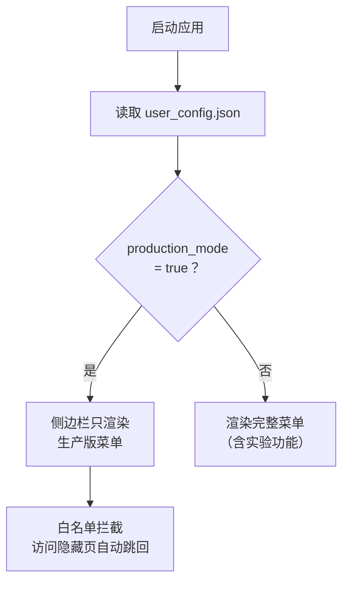

**开启方式**：设置 → 界面模式 → 生产模式 → 保存 → 刷新页面

### 8.2 打包命令

```bash
cd client
npm run dist:win    # Windows → client/release/
npm run dist:mac    # macOS
```

产物：Windows 的 `.exe` 安装包 + `.zip` 便携版；macOS 的 `.dmg` + `.zip`。

### 8.3 为什么用开关而不是删代码

| 方案 | 优点 | 缺点 |
| --- | --- | --- |
| **配置开关（已采用）** | 一套代码同时支持生产与开发；后续加功能不用维护分支 | 打包体积不减少 |
| 删代码 | 包更小 | 后续开发要恢复代码，容易出岔子 |

---

## 九、接手开发须知

### 9.1 进程边界（最重要的一条）

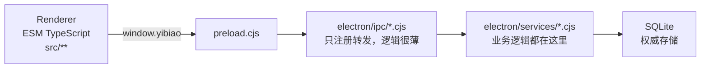

| 铁律 | 说明 |
| --- | --- |
| Renderer 不碰 Node | 不用 `fs` / `path` / `ipcRenderer` |
| `.cjs` 后缀 | Main / preload / IPC / services **必须**保持 |
| 改 preload | 必须同步改 `src/shared/types/ipc.ts` |
| 模型请求 | **必须**走 `aiService.cjs`，业务代码不许自己发 HTTP |

### 9.2 改动验证矩阵

| 改动范围 | 最低验证 |
| --- | --- |
| Renderer / TypeScript | `npm run build` |
| Main / preload / IPC | 逐个 `node --check` + `npm run build` + `npm run dev` 手测 |
| SQLite / migration / 后台任务 | 上述 + `npm run smoke:electron-native`，手测保存、重启恢复、中断状态 |
| 依赖变更 | `npm ci` + `npm run build` + `npm audit` |

### 9.3 已知边界

| 项 | 说明 |
| --- | --- |
| **代码签名** | 尚未接入 Windows / macOS 代码签名，未签名提示是**已知发布约束**，不要在普通改动里临时绕过 |
| **生产模式需刷新** | 开关变更后需手动刷新页面才生效 |
| **打包体积** | 主 chunk 约 1 MB（含 Mermaid 全量图表类型），Vite 会报 chunk 体积警告，退出码为 0 仍算成功 |
| **残留页面** | `src/features/business-bid`、`plugins`、`resources` 三个目录未被任何路由引用，属于历史遗留，后续需接入或清理 |

---

## 十、常用命令

```bash
cd client
npm ci                        # 安装（postinstall 按 Electron 重建 native 模块）
npm run dev                   # 开发（Vite 5173 + Electron）
npm run build                 # tsc --noEmit && vite build（唯一类型检查入口）
npm run smoke:electron-native # 验证 better-sqlite3 等 native 模块 ABI
node --check electron/xxx.cjs # 改 Main/preload 后逐个语法检查
node --test <file.test.cjs>   # 定向执行测试
npm run dist:win              # Windows 打包
```

---

*文档结束 · 如需补充某个环节的实现细节，请指明模块名*
